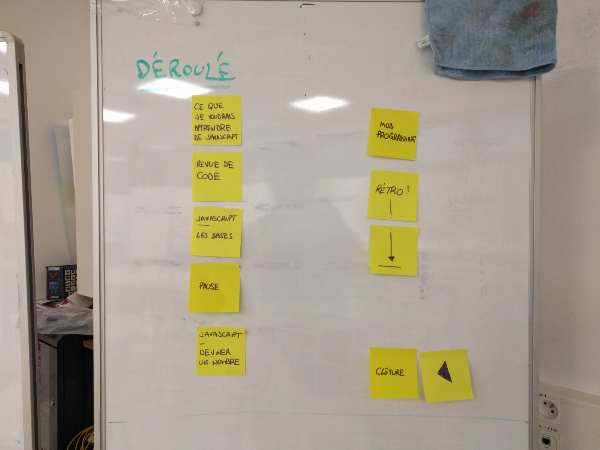
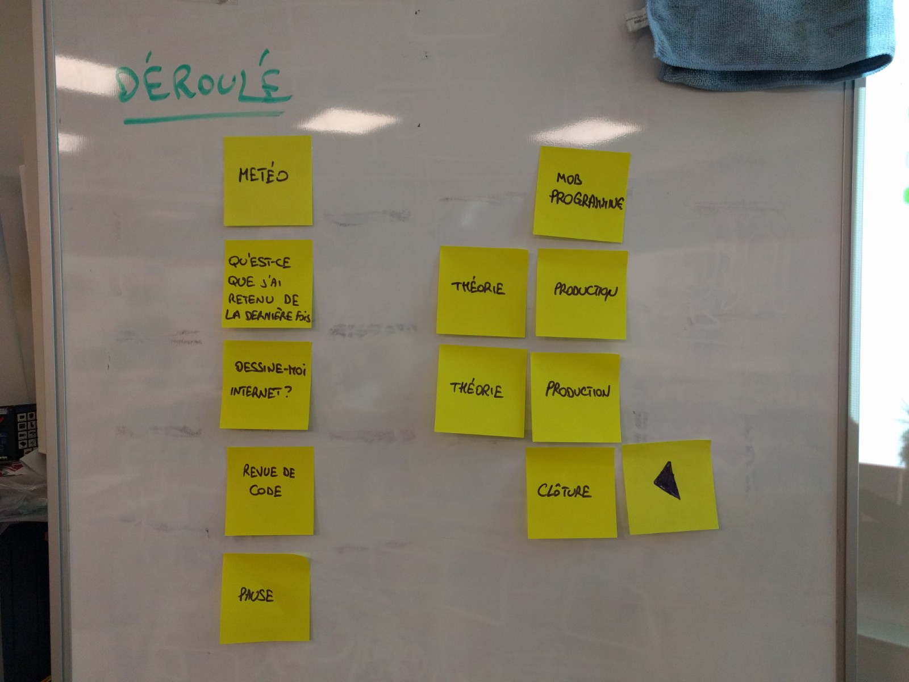
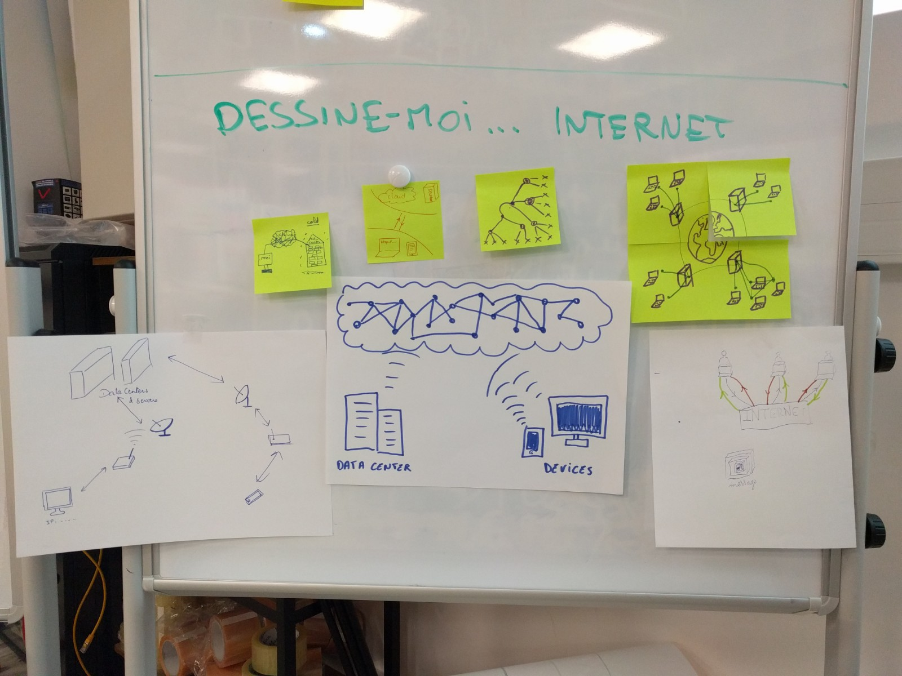
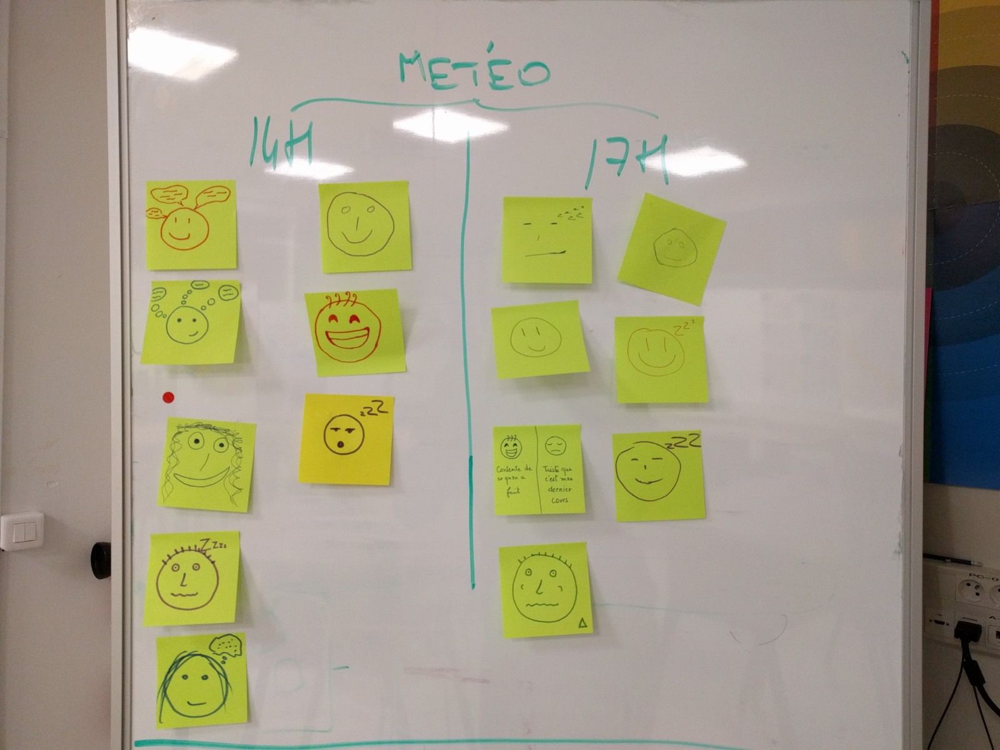

# Journal

## Jeudi 20 décembre

### Agenda

1. Ce que j'aimerais apprendre de JavaScript
2. Revue de code
3. JavaScript • Les bases
4. Pause
5. JavaScript • Coder un jeu où on doit faire deviner un nombre
6. ~~Mob programming~~
7. Rétrospective
8. Clôture

### Ce que je veux apprendre de JavaScript

- les notions de base pour utiliser JS sur un site
- la différence entre variable et fonction
- faire des animations/bandeaux déroulants
- comprendre comment ça fonctionne "en général"
- Bootstrap ou autres, pour avoir des blocs de code réutilisables
- outils pour apprendre JavaScript
- orienté objet en JavaScript

### C'était comment pour moi aujourd'hui ?

- j'ai raté la moitié de la séance parce que soutenance ; le jeu c'était cool, j'ai compris comment ça marchait
- ça a été dur de rattraper en cours de route ; j'aurais pu faire l'effort mais je ne l'ai pas fait
- intéressante la partie où on expliquait JavaScript, et le jeu ; la première partie du jeu était accessible, après c'est devenu trop, j'étais pas au top de ma forme donc ça doit jouer, je pense
- moi c'est l'inverse, ça m'a rafraîchi la mémoire
- j'ai pas eu l'impression d'apprendre quelque chose de nouveau, à part des notions sur la syntaxe (`in` et `for`), enfin des détails
- pareil, je ne pense pas avoir appris grand chose mais le format est plutôt sympa, le fait de le faire avec glitch pour que tout le monde participe, ça me va

## Mercredi 19 décembre

### Agenda

1. Météo interne
2. Qu'est-ce que j'ai retenu de la dernière fois ?
3. Dessine-moi… Internet !
4. Revue de code
5. Pause
6. Mob Programming
7. ~~Théorie / Production~~
8. ~~Théorie / Production~~
9. Clôture

### Ce que j'ai retenu de la dernière fois ?

- il faut toujours faire attention de toujours lier l'URL dans le header (script) avec le code ; et de faire attentions aux majuscules dans les intitulés (variables, JSON, etc.)
- les sélecteurs CSS ; la session mob programming avait l'air pas mal ! J'ai hâte de tester aujourd'hui
- les sélecteurs — c'était évident sur le coup ; j'ai réalisé que j'avais besoin de pratiquer pour retenir. C'est pas difficile mais ça demande de l'autonomie pour retenir
- flexbox, pour que les éléments s'affichent à la suite
- l'affichage des polices diffèrent selon les ordinateurs

### Dessine-moi… Internet !

Ce qu'on a regardé ensemble suite à ça :

- https://www.youtube.com/watch?v=0TZwiUwZwIE
- https://www.submarinecablemap.com
- https://www.datacenterdynamics.com/news/google-plans-to-double-singapore-data-center-footprint/

### C'était comment pour moi aujourd'hui ?

- j'ai bien aimé visualiser Internet
- la discussion autour d'Internet a permis de mieux comprendre comment ça fonctionne (je ne savais pas pour les câbles dans l'eau — y'a pas de nuage, je suis un peu triste mais bon !) ; la session sur JS aussi (et de comprendre que c'est compliqué) ; travailler toutes ensemble ; float:left en HTML ; la différence entre `window` et un `<script>`
- créer la map interactive ; on voulait absolument en mettre une mais on avait galéré à le faire
- c'est passé très rapidement ; j'ai bien aimé le site de umap et travailler dessus ; je me suis sentie limitée sur la taille des cercles (banal mais pratique ; Alors que Tableau c'est l'inverse) ; la visualisation d'Internet
- j'ai bien aimé Internet et la discussion ; le travail au vidéo projecteur c'est pas mal mais on ne va pas très vite, mais on comprend bien ce qui se passe — peut-être parce que je n'ai pas travaillé dessus entre 2 sessions
- c'était mon dernier cours, demain je ne pourrai pas être là :-(

## Jeudi 13 décembre

### Agenda

Cette session, l'agenda a été mouvant car le groupe n'était pas au complet, et une partie du groupe avait une soutenance de projet en parallèle, pendant une partie du cours.

1. ~~Météo interne~~
2. Revue de code
3. Mob programming
4. Pause
5. Théorie/Explications (sélecteurs CSS)
6. Planification de l'itération ([résultat](https://github.com/oncletom/m2-transfo-num/projects/4))
7. Clôture

### Mes ressentis de cette session

- je suis encore énervée d'avoir dû partir en plein milieu du cours et d'en rater un bout ; je vais essayer de faire ce qui a fait cette session pour mieux comprendre ; je commence à comprendre !
- c'est de moins en moins du chinois ; je vais essayer de faire un truc concret pour la semaine prochaine, pour ancrer ça, pour faire toute seule
- je suis contente mais c'était pénible d'être coupé dans notre élan ; le fait d'être peu et de travailler sur un même ordinateur, pour avancer et s'apprendre des choses ; j'ai consolidé ce que j'ai pu apprendre hier
- je suis contente entre l'équilibre (merci pour les viz !), et passer à des trucs un peu plus théoriques ; j'ai bien aimé cet équilibre ; revoir un code qu'on a fait, c'est bien, c'est une meilleure utilisation du temps en cours
- j'ai bien aimé travailler à plusieurs sur un seul ordi ; on peut faire les choses sur son propre ordinateur si on a envie
- j'étais pas là mais ça avait l'air bien
- je n'ai pas pu me lancer encore dans les vis, donc ça me donne l'occasion de m'y mettre pour la semaine prochaine

## Mercredi 12 décembre

### Agenda

1. Météo interne
2. 1 truc important (que j'ai retenu de la dernière fois)
3. Revue de code
4. Production + Théorie/Explications
5. Pause
6. Production + Théorie/Explications
7. ~~Production + Théorie/Explications~~
8. Clôture

### Ce que j'ai retenu de la session précédente

- je suis reparti avec l'envie de faire un dépôt GitHub perso, et de suivre des projets sur GitHub
- j'étais pas là et je regrette
- même si ça paraissait abstrait ce qu'on avait à faire, ça me paraissait faisable, c'était pas si compliqué que ça
- je suis repartie avec "enfin" une compréhension des méthodes agiles

### Mes ressentis de cette session

- j'ai essayé de faire un graph dynamique en Python, ça ne marche pas encore, mais je ne suis pas loin !
- je repars avec un bug ! Je n'ai pas réussi à faire ma ligne dynamique
- on a arrangé 2-3 petits trucs, c'était utile
- j'ai compris des trucs de base, et demain j'aimerais être un peu plus proactive pour apprendre plus
- j'ai eu des réponses à mes questions, il y en a d'autres où je n'ai pas de réponses ; ça m'a donné envie de regarder Vega Lite
- j'ai bien aimé apprendre des trucs sur `display`
- j'ai bien aimé la partie théorique sur `display`
- j'ai bien aimé la nouvelle structure du cours, on connait le déroulement de la séance, de voir toutes ensemble le problème et avancer de manière assez libre

## Jeudi 6 décembre

### Agenda

1. Météo interne
2. Pourquoi le développement web ?
3. Les méthodes agiles : Scrum et Kanban
4. Temps des Questions
5. Planification de l'itération ([résultat](https://github.com/oncletom/m2-transfo-num/projects/1))
6. Production
7. Temps des questions
8. Clôture

### Mes ressentis de cette session

- je suis contente car ça a été bien structuré (j'aime bien savoir où on va, c'était visuel) ; je suis satisfaite de ce fonctionnement de cours avec backlog ; ça fait une bonne transition avec la vie active ; vivement la semaine prochaine
- je suis aussi contente de ce cadre ; on voulait un cadre mais on savait pas celui qu'on voulait, et là ça me va ; j'ai bien apprécié les étapes, un mur avec les questions, ça sera surtout utile pour les prochains cours ; c'est bien de se fixer des objectifs sur une semaine — je ne sais pas comment on fera la semaine prochaine quand on aura 2 cours par semaine
- je suis complètement d'accord, j'ai bien aimé ce mode de fonctionnement
- c'est marrant parce que je n'ai pas eu le ressenti d'être dans un cours structuré mais par contre oui sur la méthode agile ; on avait des objectifs ; je n'avais pas l'impression d'être en cours mais j'ai bien apprécié ce que j'ai fait
- j'ai trouvé que c'était bien organisé, on savait où on allait, c'est resté un peu abstrait et j'ai hâte qu'on mette ça en pratique, qu'on redescende d'un niveau
- j'ai apprécié le cours, j'ai envie de mettre ça plus en pratique ; je suis conscient que ce sont des attentes assez vagues
- j'aime bien les discussions pendant les cours mais quand y'a trop de discussions, je perds le fil ; j'ai hâte de la mise en pratique

## Jeudi 29 novembre

### Ça s'est passé comment pour moi ?

- la démarche de faire un cours collaboratif c'est bien
- en étant débutante, c'est plus dur de savoir quoi faire, où aller
- c'était intéressant d'avoir une approche globale sur les langages
- sur la mise en pratique, j'aurais aimé aller plus vite ou en autonomie
- j'ai un peu laché à un moment donné quand c'est devenu lent pour moi
- j'ai trouvé ça chouette JS avec le bouton mais je suis moins sûre de la mise en pratique

### La prochaine fois, j'aimerais changer un truc

- mieux accompagner, mieux structurer (comprendre les notions de balise, structurer une page, ordonner les balises) pour mieux savoir où commencer
- j'aimerais comprendre comment on passe du code au serveur et à ce que je vois ?
- plus de mise en application concrète (un peu comme le bouton image mais plus), un peu de travail en autonomie mais pas que
- aller davantage en profondeur sur la partie dynamique
- plus de structuration pour les bases
